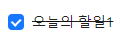

# 💬 react-antd-todo


## 🌟 프로젝트 소개

`React`와 `Ant Design`을 활용한 간단한 할일 관리 애플리케이션입니다.

### 주요기능

- 새로운 할 일 추가
- 할일 완료 체크
- 할일 삭제

### 기술 스택

- React
- Ant Design
- JavaScript(ES6+)
- CSS3

## 📢 설치 및 실행

1. 작업 폴더로 이동<br/>

```bash
cd react-antd-todo
```

2. 의존성 설치 <br/>

```bash
yarn install
```

3. 실행<br/>

```bash
yarn start
```

## 📢 주요 기능

### 🎇 새로운 할일 추가

<br/>
빈칸에 할일을 작성하고 `Enter` 키를 누릅니다.<br/>


### 🎇 완료한 할일 체크

할일 목록 좌측  아이콘을 눌러 완료한 한일을 체크 표시합니다.<br/>



### 🎇 작성한 할일 삭제

할일 목록 우측  아이콘을 눌러 작성한 할일을 목록에서 삭제합니다.

<br/>

## 📢 구현

### 🌎 Structure

```python
root/
├── examples/            # 예시 이미지 폴더
├── react-antd-todo/     # 메인 프로젝트 폴더
│   ├── node_modules/    # 프로젝트 의존성 모듈
│   ├── public/          # 정적 파일 폴더
│   ├── src/             # 소스 코드 폴더
│   │   ├── App.js       # 메인 애플리케이션 컴포넌트
│   │   ├── App.test.js  # App 컴포넌트 테스트 파일
│   │   ├── index.css    # 메인 스타일시트
│   │   ├── index.js     # 애플리케이션 엔트리 포인트
│   │   ├── reportWebVitals.js # 웹 성능 측정 유틸리티
│   │   └── setupTests.js # 테스트 설정 파일
│   ├── .gitignore
│   ├── package.json     # 메타데이터 및 의존성 정보
│   ├── yarn.lock        # Yarn 의존성 잠금 파일
└── README.md            # 프로젝트 문서
```

### 🌎 새로운 할일 추가

#### 🚲 1. 상태관리

##### 1-1. `useState`를 이용해 초기 `할일 목록` 관리

- 초기 화면에는 항상 예시 목록을 띄워줌
- 각 `할일`마다 고유 `id`를 부여하여 추가/삭제가 용이하게 함
- `할일`은 `text` 속성으로 저장
- `할일`의 `완료 여부`를 관리하기 위해 `completed` 속성을 추가

```jsx
const [todoList, setTodoList] = useState([
  { id: 1, text: '오늘의 할일1', completed: false },
  { id: 2, text: '오늘의 할일2', completed: false },
]);
```

##### 1-2. `onChange()`와 `useState`를 이용해 입력창의 데이터를 저장하는 `current` 변수 관리

- 텍스트로 할일을 입력하는 `input` 창 생성

```html
<input
  value="{current}"
  placeholder="오늘의 할일을 작성하세요."
  onChange="{onChange}"
  onKeyDown="{onKeyDown}"
/>
```

- 입력창의 데이터를 저장하는 `current` 변수 생성

```javascript
const [current, setCurrent] = useState('');
```

- `input` 태그 내부의 값이 변동될 때마다 `current`를 변경하는 `onChange` 함수

```javascript
const onChange = (e) => {
  setCurrent(e.target.value);
};
```

### 🌎 Todo 표시

- `antd`의 `List` 컴포넌트 활용

#### 1. `todo`를 넣어 `List.item`으로 렌더링

```html
          <List
            dataSource={todoList} // 표시될 데이터
            renderItem=
            {(todo) => (
              <List.Item
                actions={[
                ]}
              >
              </List.Item>
          </List>
```

#### 2. 완료한 할일을 체크 표시할 수 있는 `Checkbox` 요소 추가

- 체크 상태를 관리할 수 있는 `checked` 속성을 `todo.completed`로 관리
- 값이 변동되는 경우 `toggleTodo`에 `todo.id`를 전달
- `todo.completed`값이 완료 상태일 경우, `textDecoration`에서 삼항 연산자를 이용해 취소선을 그어줌

```html
                <Checkbox
                  checked={todo.completed}
                  onChange={() => toggleTodo(todo.id)}
                >
                  <span
                    style={{
                      textDecoration: todo.completed ? 'line-through' : 'none',
                    }}
                  >
                    {todo.text}
                  </span>
                </Checkbox>

            )}
            style={{
              marginBottom: '16px',
            }}
          />
```

#### 3. 할일의 완료 상태 관리를 돕는 `toggleTodo`함수

- `id`를 전달받아 `TodoList`에서 완료상태 변경을 도움

```javascript
const toggleTodo = (id) => {
  setTodoList(
    todoList.map((todo) =>
      todo.id === id ? { ...todo, completed: !todo.completed } : todo
    )
  );
};
```

### 🌎 Todo 추가

- `input` 태그 내부에 커서가 있을 때 `enter` 키를 누르면, 새로운 할일이 기존 할일 목록에 추가되는 `onKeyDown` 함수
  - 단, 새로운 할일이 공백을 제외하고 0보다 큰 길이를 가져야 함
  - `id`는 현재 `date`로 설정
  - `text`는 공백을 제거한 `current` 값으로 설정
  - `completed`는 기본 `false` 값

```javascript
const onKeyDown = (e) => {
  if (e.key === 'Enter') {
    if (current.trim().length > 0) {
      const newTodo = {
        id: Date.now(),
        text: current.trim(),
        completed: false,
      };
      setTodoList([...todoList, newTodo]);
      // 새로운 할일을 기존의 할일 목록에 추가
      setCurrent('');
      // 현재 저장된 input 창 내부 값을 비워줌
    }
  }
};
```

### 🌎 Todo 삭제

#### 1. 삭제 버튼 추가

```javascript
<Button
  type="text"
  icon={<DeleteOutlined />}
  onClick={() => deleteTodo(todo.id)}
/>
```

#### 2. `deleteTodo` 함수 구현

- `id`를 전달해, `todoList`의 상태를 변경
- `filter` 함수를 이용해 해당 `id`를 가진 항목을 제외한 새로운 배열 생성 => 상태 업데이트

```javaScript
const deleteTodo = (id) => {
  setTodoList(todoList.filter((todo) => todo.id !== id));
};
```

### 🌎 UI 구현

- `Ant Desing`의 `Flex`, `List`, `Input`, `Checkbox`, `Button` 컴포넌트 활용
- 할일 목록 표시에 `List` 컴포넌트 사용
- 새 할일 입력에 `Input`컴포넌트 사용
- 할일 완료 표시에 `Checkbox`컴포넌트 사용
- 할일 삭제에 `Button`컴포넌트와 `DeleteOutlined`아이콘 사용

## 📢 학습 및 성장

- React Hooks(`useState`)를 활용한 상태 관리 방법 학습
- Ant Design 컴포넌트를 활용한 UI 구현
- 향후 다양한 기능(카테고리 분류, `useMemo`등을 활용한 최적화)를 추가하면 학습에 도움이 될 것 같음
